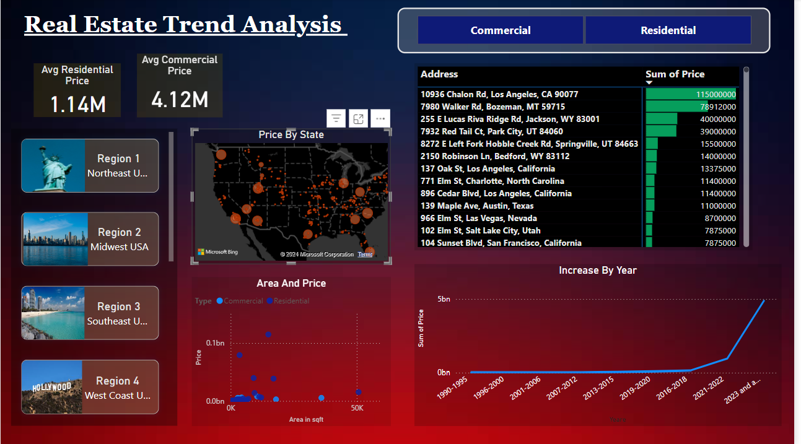
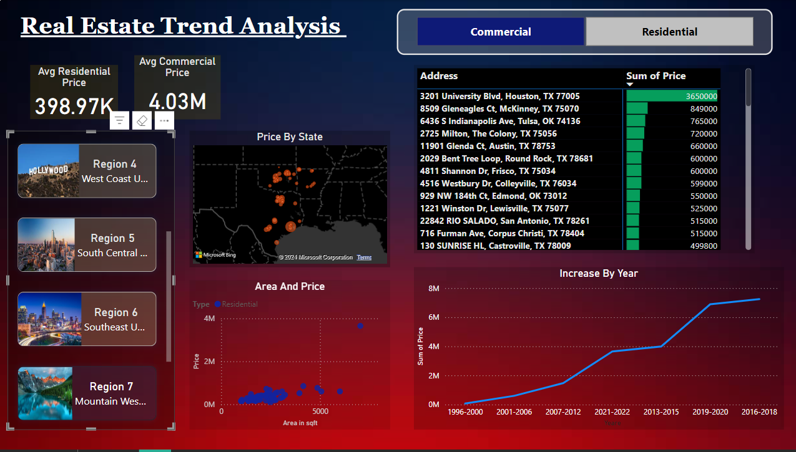

# Housing Market Trend Analysis

### Project Overview
This project analyzes real estate market trends across various regions in different worlds using Python for data collection and Power BI for visualization.

### Tools and Libraries
- Python: Used for web scraping and data cleaning.
- Libraries: pandas, BeautifulSoup, regex for text processing.
- Power BI: For visualizing trends in housing prices, geographic variations, and property type filters.

### Key Tasks
1. Data Collection: Scraped real estate listings, capturing details like prices, locations, and property types using BeautifulSoup.
2. Data Cleaning: Processed the data with pandas and regex to remove duplicates and handle missing information.
3. Data Analysis: Calculated average prices by location and property type to uncover pricing trends.
4. Visualization: Created Power BI dashboards to show price trends, geographic price variations, and property (features such as location) influence on prices.

The following Power BI visualizations :

#### Geographic Price Variations

#### Price Trends by Property Type

